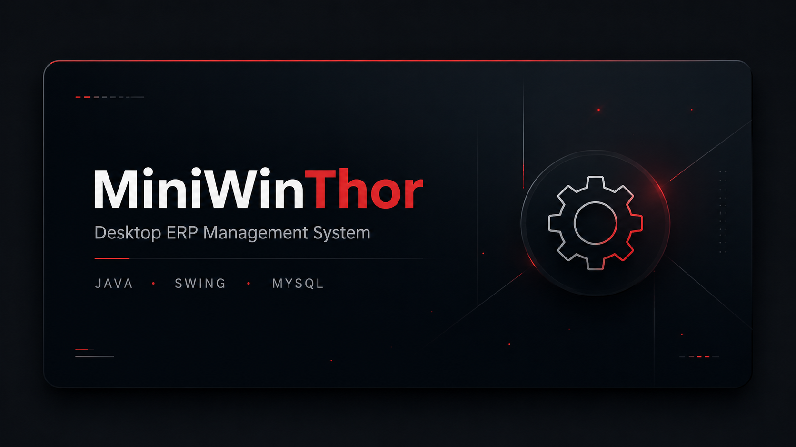
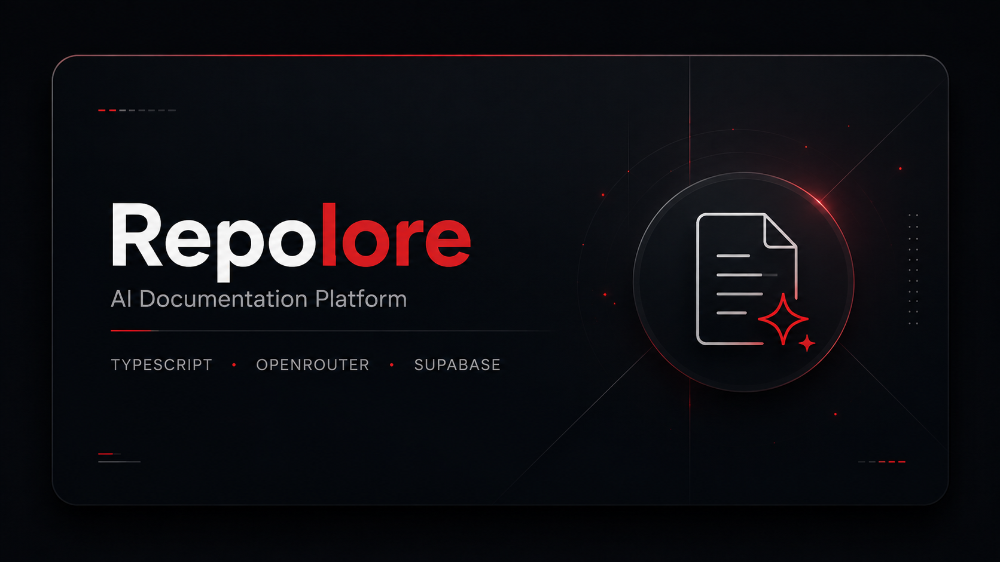
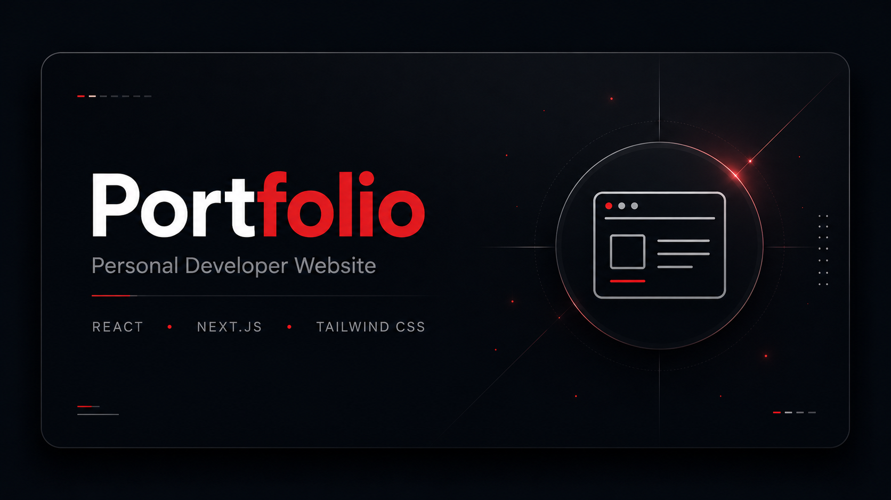

 

<h1 align="center">Rickelmy Pablo</h1>

Software Developer • ADS Student

Building software, one project at a time.

---

# 📖 Sorcerer Profile

<table>
<tr>

<td width="36%" valign="top" align="center">

 

<i>"Keep moving forward."</i>

</td>

<td width="64%" valign="top">

# Rickelmy Pablo

### Software Developer

Analysis and Systems Development Student

 

### Focus

- Web Development
- Artificial Intelligence
- SaaS Development

 

### Current Projects

- 🚀 MiniWinThor
- 📄 Repolore

</td>

</tr>
</table>

---

# Currently Building

<table>
<tr>

<td width="100%" valign="top">

### Repolore

AI-powered documentation platform focused on helping developers generate and maintain project documentation more efficiently.

**Current Focus**

- AI-assisted README generation
- Project documentation
- OpenRouter integration
- Supabase backend
- Modern web interface

 

</td>

</tr>
</table>

---

# Tech Stack

### Languages

### Frameworks & Libraries

### Database

### Tools

---

# Featured Projects

<table>

<tr>

<td width="33%" valign="top" align="center">

 

### MiniWinThor

Desktop ERP inspired by WinThor.

**Tech**

Java • Swing • MySQL

 

</td>

<td width="33%" valign="top" align="center">

 

### Repolore

AI Documentation Platform.

**Status**

🚧 In Development

 

</td>

<td width="33%" valign="top" align="center">

 

### Portfolio

Personal developer website.

**Status**

Planning

 

</td>

</tr>

</table>

---

# Development Activity

 

 

# Current Focus

- 🚀 Building **Repolore**, an AI-powered documentation generator.
- 📚 Studying Systems Analysis and Development (ADS).
- ☁️ Learning modern backend architecture with Supabase and OpenRouter.
- 🎯 Focused on creating high-quality software and open-source projects.

---

# Let's Connect

---

Thanks for stopping by.

 

<i>
"Keep moving forward."
</i>

